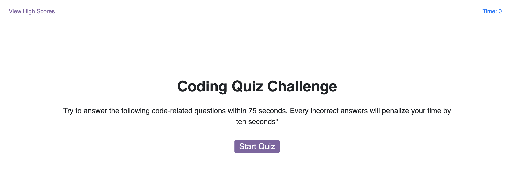
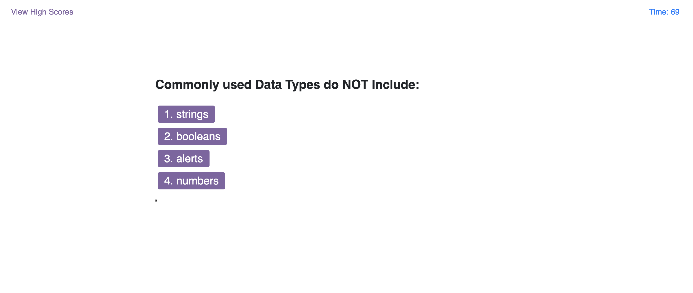
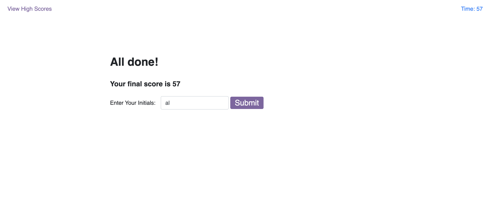
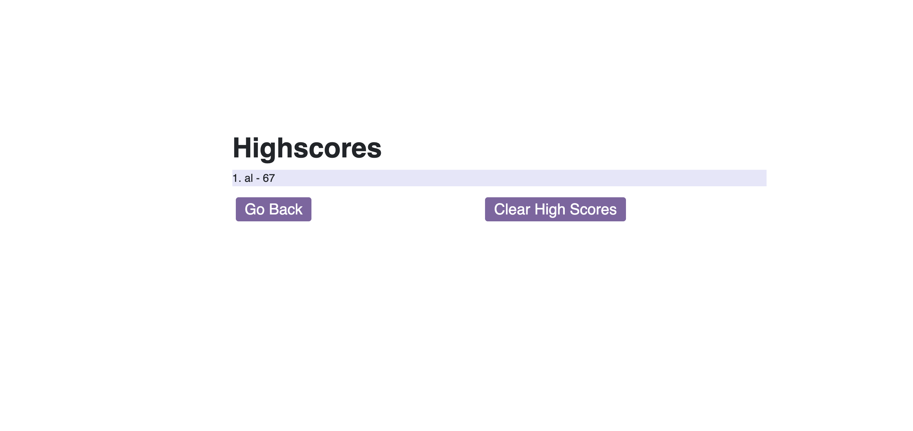

# Description

A short coding quiz for you to test your rudimentary knowledge of coding. When you are finished answering the questions, your score can be saved to a local high scores list which can also be reset.

## Technologies Used

HTML, CSS, JavaScript

Screenshots of the app in use: 

